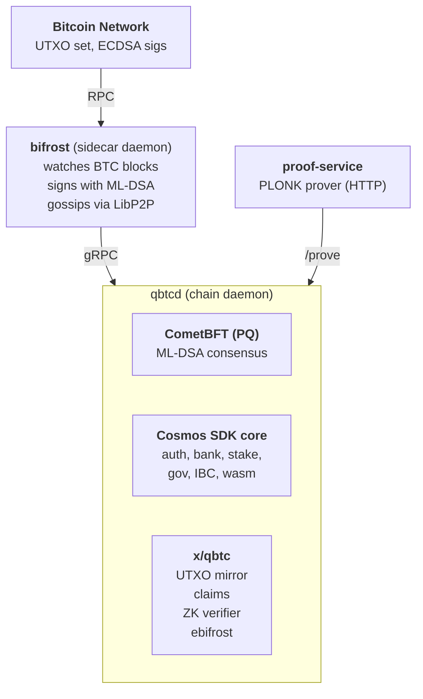

# Architecture

QBTC is a Cosmos SDK application chain that runs on a forked CometBFT consensus engine using post-quantum signatures. It maintains a mirror of the Bitcoin UTXO set inside its own state and accepts zero-knowledge proofs of BTC ownership as claims against that mirror.

For deeper specifications, see the [Protocol Specification](../research/protocol-spec.md).

## High-level picture

## The four major components

### 1. The chain daemon (`qbtcd`)

`qbtcd` is a Cosmos SDK v0.52-era application binary. It registers the standard SDK modules (`auth`, `bank`, `staking`, `slashing`, `distribution`, `gov`, `upgrade`, `evidence`, `feegrant`, `authz`, `consensus`, `params`, `epochs`, `group`, IBC v10, ICS-27 interchain accounts, IBC transfer, CosmWasm, and `tokenfactory`) and adds one custom module: **`x/qbtc`**.

Notable chain parameters:

* **Bech32 prefixes:** `qbtc` (accounts), `qbtcvaloper` (validators), `qbtcvalcons` (consensus).
* **Default bond denom:** `qbtc`.
* **Coin type:** 118 (standard Cosmos).

### 2. The post-quantum consensus engine (CometBFT, forked)

QBTC depends on a fork of CometBFT that introduces a new `crypto/mldsa` package and routes consensus signing through ML-DSA (CRYSTALS-Dilithium / FIPS 204) instead of Ed25519.

Every validator's consensus key is an ML-DSA key, every vote is signed with ML-DSA, every block-commit signature is ML-DSA. No wrapper or sidecar layer. The fork is maintained at `github.com/btcq-org/cometbft`.

ML-DSA-65 signatures are larger than Ed25519 (3309 bytes vs. 64 bytes per FIPS 204), which affects block size and bandwidth. The trade-off is intentional: a chain that exists to be quantum-safe cannot have any ECDSA or Ed25519 dependency in its consensus path.

See [Quantum Resistance (ML-DSA)](quantum-resistance.md) for details.

### 3. The custom module (`x/qbtc`)

The single custom module handles everything QBTC-specific:

| Subfolder | Responsibility |
|---|---|
| `keeper/` | State management and message handlers for claims and UTXO mirror |
| `types/` | Protobuf-generated types and message validation |
| `module/` | Cosmos module wiring and genesis state loader |
| `zk/` | PLONK circuits and the on-chain verifier for claim proofs |
| `ebifrost/` | "Enshrined bifrost" — in-chain logic that accepts gossiped Bitcoin blocks from validator sidecars and injects them as special transactions |

The module's surface area is intentionally small. Standard SDK modules handle staking, governance, fees, and IBC. The custom module is the part that has to be QBTC-specific.

### 4. The validator sidecar (`bifrost`)

Each validator runs a `bifrost` process alongside `qbtcd`. Its job is narrow:

1. Connect to a Bitcoin full node via RPC and watch for new blocks.
2. When a new BTC block arrives, gzip it and sign it with the validator's QBTC consensus key (ML-DSA).
3. Gossip the signed block to peer validators' `bifrost` processes via LibP2P.

The chain's `x/qbtc/ebifrost` module receives these signed blocks via gRPC and includes them in QBTC blocks as **injected transactions**. A Bitcoin block is only considered ingested once more than **2/3 of bonded validator power** has attested to it.

QBTC's view of Bitcoin is itself produced by a Byzantine-fault-tolerant consensus, not by a single oracle or trusted relayer.

### 5. The proof service (`proof-service`)

ZK proof generation runs client-side. Wallets handle it natively. On constrained devices, the `proof-service` is a standalone HTTP service that takes user-constructed proof inputs and computes the cryptographic output.

Anyone can host a `proof-service` instance. Multiple independent operators will run them. Users (or their wallet) pick by trust, latency, or convenience. The proof service does not see private key material in a form that lets it forge claims; the witness is constructed locally on the user's side.

A CLI version (`zkprover`) is available for users who want to generate proofs locally.

## Binaries shipped

| Binary | Purpose |
|---|---|
| `qbtcd` | Chain daemon (validators and full nodes run this) |
| `bifrost` | BTC block watcher and gossiper (every validator runs one) |
| `proof-service` | Remote PLONK prover (optional infrastructure, anyone can host) |
| `zkprover` | CLI for local proof generation |
| `utxo-indexer` | Builds the genesis UTXO snapshot from a Bitcoin node |

## The data flow for a single claim

1. User decides to claim their BTC at address `1A1z...` to a QBTC address `qbtc1...`.
2. User opens a quantum-safe wallet, which constructs the proof inputs locally: the BTC private key, the destination QBTC address, and the UTXO reference.
3. The wallet either generates the ZK proof locally (`zkprover`) or sends the proof inputs to a `proof-service` instance.
4. The completed proof is submitted to QBTC as a `MsgClaimWithProof` transaction. A single transaction can claim up to 50 UTXOs at once.
5. A QBTC validator picks up the transaction, runs the on-chain PLONK verifier, checks each referenced UTXO has an outstanding claim, and checks the destination address is valid.
6. The transaction lands in a block. The claim is released to the destination QBTC address and the corresponding entry is marked as exhausted, preventing double-claims.

The user's BTC is never moved. The user's BTC public key is never broadcast.

## How Bitcoin's state stays mirrored

1. Bitcoin produces a block.
2. Each validator's `bifrost` reads the block from its Bitcoin node.
3. Each `bifrost` gzips the block, signs it with the validator's ML-DSA consensus key, and gossips it.
4. The QBTC `ebifrost` module aggregates signatures. When more than 2/3 of bonded validator power has attested to the same block, it is accepted.
5. The accepted block is injected as a special transaction in the next QBTC block. The transaction updates the UTXO mirror: new outputs become claims, spent outputs are reconciled.
6. Coinbase outputs add new claim entries. Bitcoin miners receive a corresponding QBTC claim as well.

## Read next

* [Quantum Resistance (ML-DSA)](quantum-resistance.md)
* [Consensus & Validators](consensus.md)
* [Claim Mechanism](claim-mechanism.md)
* [Protocol Specification](../research/protocol-spec.md)
